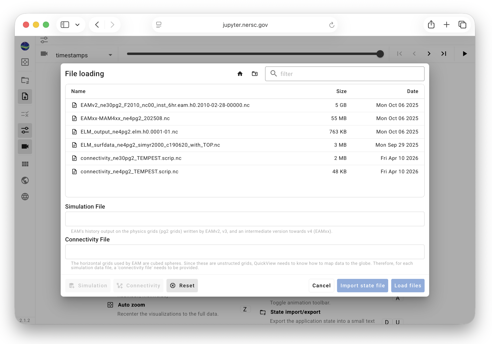
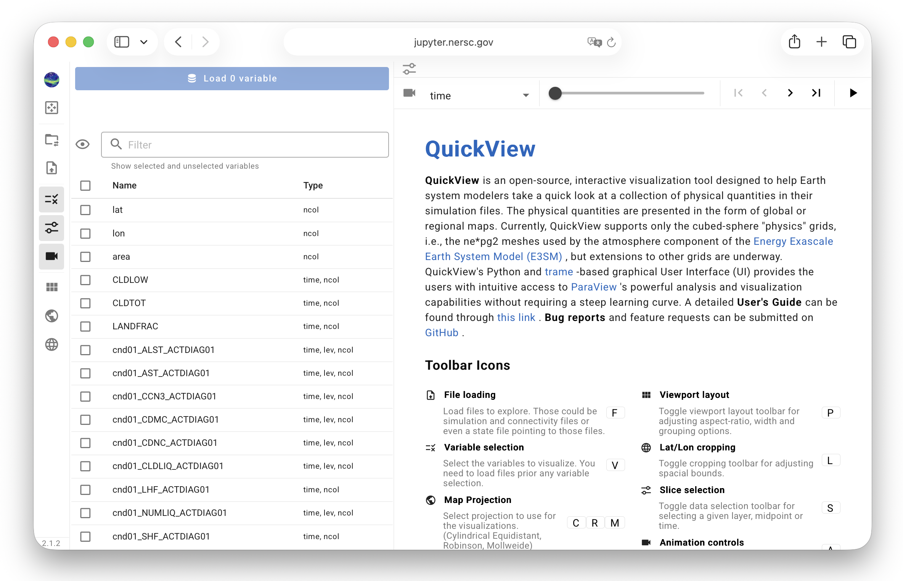

# Selecting Files for Analysis

QuickView can be used in two modes:
- a **new-viz mode** for starting a new visualization or
- a **resume mode** for continuing an earlier analysis saved in a state file.

## New-viz mode: starting a new visualization

{ width="5%", align=right }

When QuickView is launched using a shell command or the desktop bundle,
or when the user clicks the "File loading" icon on the toolbar,
the a dialogue window like the screenshot below will be brought up.
The user is expected to select a connecitivy file and at least one a simulation data file
from the file system.

{ width="80%", align=center }

The user can single-click a file name and then click the "simulation" or "connectivity"
button to clarify file type, and repeat these two clicks to have both files specified.

Alternatively, if a filename starts with "connecitivity", then
the user can double-click the file to have it automatically recognized as a connectivity file.
Double-clicking a filename not starting with "connectivity" will
have it registered as a simulation file in the app.

After both connectivity and simulation files are selected,
click the blue `Load Files` button. 
When the files are loaded correctly, the UI will change into a layout like
the example below, with the [Variable Selection control panel](./variable_selection)
on the left showing a list of recognized variables in the simulation file
and the viewport on the right showing the landing page.
The user can now start to search for and load variables to inspect.

{ width="80%", align=center }

## Resume mode: pick up where you left off

::: error TO-DO: check and explain state file download and upload
:::

::: info Info: What's in a State File?
A state file is a JSON file that contains the paths and names of
the connectivity and data files being used as well as the settings
the user has chosen for the visualization; the *contents* of the
connectivity and simulation files are *not* included.

If a state file is shared among multiple users or used across different
file systems, or if a user wants to apply the same visualization settings
to a different simulation data file, then the file names and paths
at the beginning of the state file need to be edited before the state
file is loaded in the app.
:::

::: warning Tip: State File Loading Error
If the app seems nonresponsive after a state file has been chosen
and the `Open` button in the dialogue window has been clicked,
there is a high chance that the paths and names of
the connectivity and simulation data files contain errors.
The user should consider using a text editor to inspect the first
few lines of the state file and verify correctness.
:::

