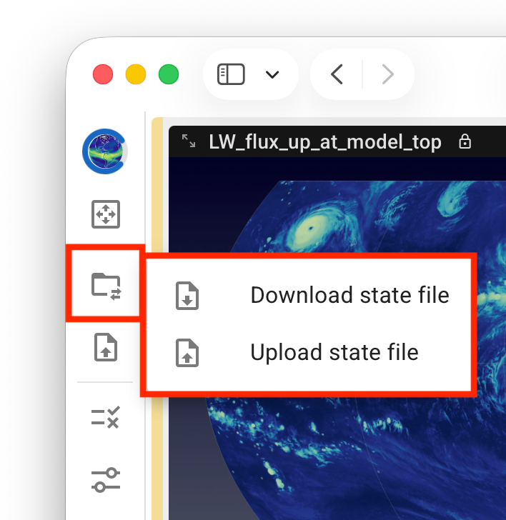

# Selecting Files for Analysis

QuickView can be used in two modes:
- a [**new-vis mode**](#new-analysis) for starting a new visualization or
- a [**resume mode**](#state-files) for continuing an earlier analysis saved in a state file.
These are explained below.

## New-vis mode: starting a new analysis {#new-analysis}

{ width="5%", align=right }

When QuickView is launched using a shell command or the desktop bundle,
or when the user clicks the "File Loading" icon on the toolbar,
a dialogue window like the screenshot below is brought up.
The user is expected to select a connectivity file and at least one simulation data file
from the file system.

{ width="95%", align=center }

The user can single-click a file name and then click the "simulation" or "connectivity"
button in the bottom-left corner to clarify file type.

Alternatively, if a filename starts with "connecitivity", then
the user can **double-click** the file to have it automatically
recognized as a connectivity file.
Double-clicking a filename not starting with "connectivity" makes
it recognized as a simulation file.

After both connectivity and simulation files are selected,
the originally pale-blue `Load Files` button in the bottom-right corner
changes to bright blue. A single click starts file loading.

If the files are loaded correctly, the UI changes into a layout like
the example below, with the [Variable Selection control panel](./variable_selection)
on the **left** showing a **list of parsed variables** in the simulation file(s)
and the viewport on the **right** showing a **brief introduction to QuickView**.
The user can now start to search for and load variables to inspect.

{ width="95%", align=center }

::: tip Tip: File system navigation
{ width="12%", align=right }
For QuickView installed through conda,
the start directory is the directory in which the app is launched.
After launch, the File Loading dialogue window
shows the contents in that directory, and the user can double click
the listed subfolders or use the folder icon with an upward arrow to
go to the parent directory. A click on the house icon switches
back to the start directory.
This concept of the start directory is why we recommend that
users launch QuickView in a directory close to their data.
:::

## Resume mode: picking up where you left off {#state-files}

{ width="28%", align=right }

The current state of the analysis session can be saved—and reloaded later to resume
the analysis—using the `State Import/Export` button in the vertical toolbar
or using the shortcut `D` for download and `U` for upload.

Note that regardless of whether QuickView is execulated on a local computer
or on a remote system, the state files are saved to and uploaded from the local computer.

::: info Info: What's in a State File?
A state file is a JSON file that contains the paths and names of
the connectivity and data files being used as well as the settings
the user has chosen for the visualization; the *contents* of the
connectivity and simulation files are *not* included.

If a state file is shared among multiple users or used across different
file systems, or if a user wants to apply the same visualization settings
to a different simulation data file, then the file names and paths
at the beginning of the state file need to be edited before the state
file is loaded in the app.
:::

