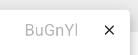

# Custimizing Individual Views

{ width="75%", align=right }

Each view in the viewport (i.e., a contour plot shown on a global or regional map)
can be customized individually by clicking the associated colorbar.
The click brings up a small pop-up panel as shown by the screenshot here,
allowing the user to control various properties of the mapping between
the variable values and the contour colors.

## Colormap search and selection

{ width="10%", align=right }

QuickView has included most of the colormap "presets" from [ParaView](https://www.paraview.org/)
and all palettes from the color vision deficiency-friendly (CVD-friendly)
[colormap collection by Fabio Crameri](https://www.fabiocrameri.ch/colourmaps/).
By default, the pop-up panel presents the full list (from both sources) for the user to choose from.
A click on the color pallete icon in the top-left corner of the pop-up panel
changes the button to a shield icon and limits the presented list to
the [collection by Fabio Crameri](https://www.fabiocrameri.ch/colourmaps/).

{ width="18%", align=right }

The top-right corner of the pop-up panel contains a text box for filtering colormaps
using a fuzzy search on their names. The x icon clears the filter.

The second icon in the top-left corner that shows a water drop in half black and half white
can be used to revert or reset the sequence of colors. 

## Linear or symmetric logarithmic scales

## Automatic or fixed data ranges

By default, QuickView automatically spans the selected colormap over the range of values
of the current variable in the current data slice.
When the pencil icon is clicked, the maximum and minimum values are displayed
When the "play" button in the [animation control panel](./slice_selection) is used to
step through different data slices,
the colormap is automatically re-adjusted to fit the data range of each slice.
If the user specifies maximum and/or minimum values,
the colormap will be fixed to the user-specified range for all data slices.

