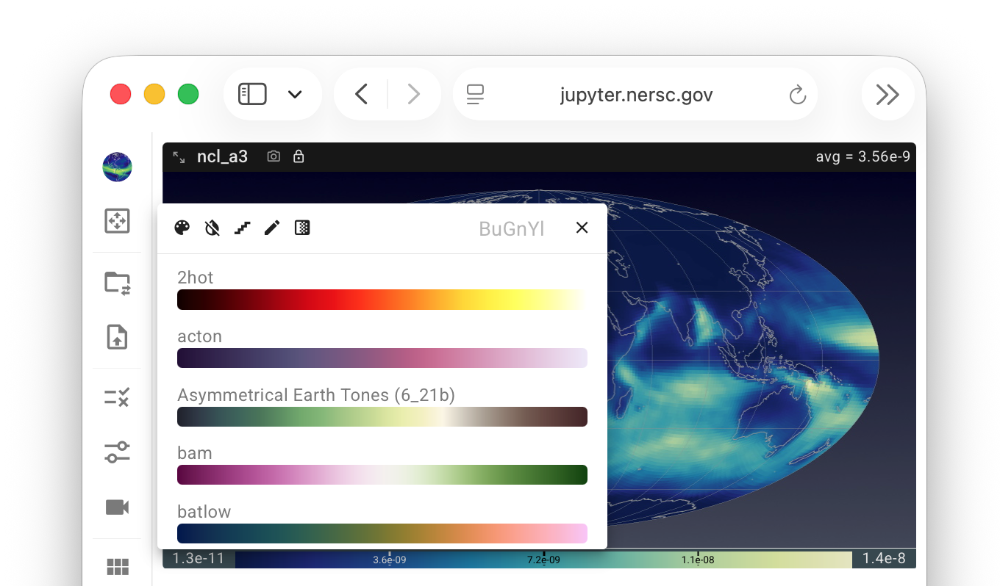
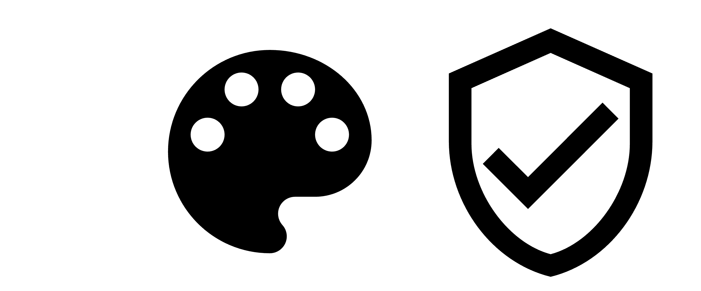
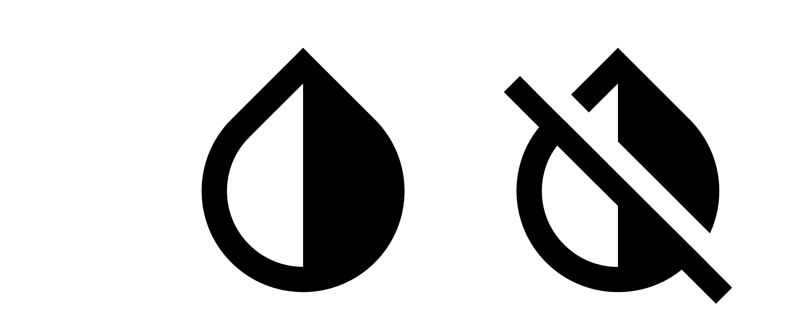
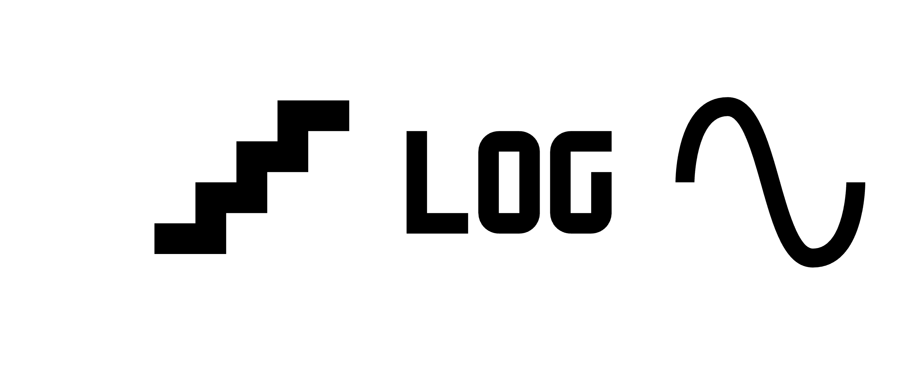
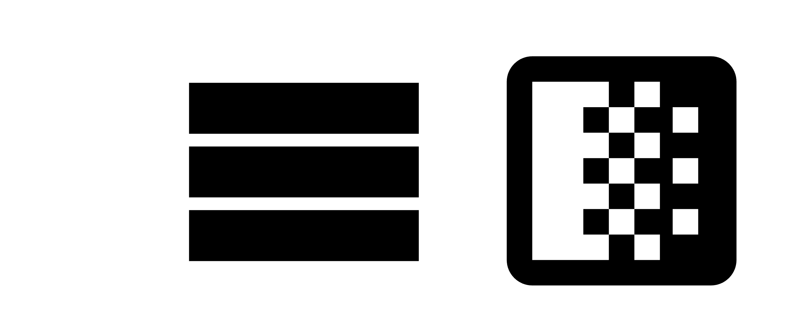
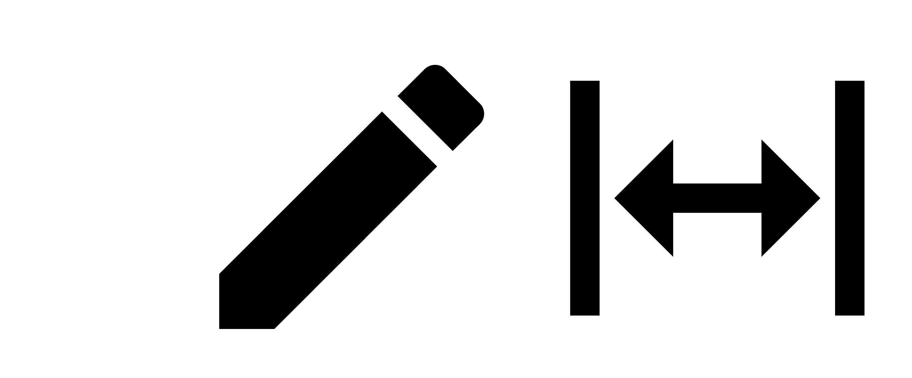
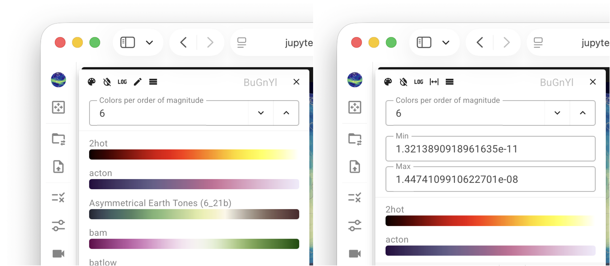

{ width="60%", align=right }

# Customizing Individual Views

Each view in the viewport (i.e., each contour plot shown on a global or regional map)
can be customized individually by clicking the associated colorbar.
The click brings up a small pop-up panel like in the screenshot here,
allowing the user to control various properties of the mapping between
the variable values and the contour colors.

## Colormap search and selection

{ width="12%", align=right }

QuickView has included most of the colormap "presets" from [ParaView](https://www.paraview.org/)
and all palettes from the color vision deficiency-friendly (CVD-friendly)
[colormap collection by Fabio Crameri](https://www.fabiocrameri.ch/colourmaps/).
By default, the pop-up panel presents colormaps from both sources for the user to choose from.
A click on the color palette icon in the top-left corner of the pop-up panel
changes the button to a shield icon and reduces the displayed list to
the [collection by Fabio Crameri](https://www.fabiocrameri.ch/colourmaps/).

The top-right corner of the pop-up panel contains a text box for filtering colormaps
using a fuzzy search on their names. The x icon clears the filter.

{ width="12%", align=right }

The second icon in the top-left corner is a toggle
for inverting and resetting the sequence of colors. 

## Linear vs. logarithmic scales {#linear-and-log-scales}

{ width="16%", align=right }

QuickView supports both linear and logarithmic color scaling to facilitate the inspection of variables that span multiple orders of magnitude.

- By default, a **linear scale** is used, indicated by a staircase-style icon in the pop-up panel.

- A click on the staircase icon changes the scaling to **logarithmic** to enhance the visibility of variations across multiple orders of magnitude.

- Because standard logarithmic scaling is only defined for positive values, QuickView also provides a **symmetric logarithmic (“symlog”)** scale, which accommodates negative values and zero. The symlog scale behaves linearly in a small region around zero and logarithmically away from zero, enabling consistent visualization of fields that include both positive and negative values.

## Continuous vs. discrete colormaps

{ width="12%", align=right }

QuickView supports both continuous and discrete colormaps, which can be toggled using the corresponding icon in the pop-up panel. A continuous colormap maps data values smoothly along a color gradient, so each value is represented by a unique color. In contrast, a discrete colormap groups values into a finite number of color bins, assigning the same color to all values within each bin .

When a discrete colormap is selected, a text box allows the user to specify the number of colors.

-  With a linear scale, this value is interpreted as the number of colors between two neighboring (automatically determined) colorbar ticks.
-  With a logarithmic scale, it instead specifies the number of colors per order of magnitude.

## Automatic vs. fixed data ranges

By default, QuickView automatically fits the selected colormap over the entire range of values
of the current variable in the current data slice.
When the "play" button in the [animation control panel](./slice_selection) is used to
step through different data slices,
the colormap is automatically re-adjusted to fit the data range in each slice.

{ width="12%", align=right }

A click on the pencil icon in the pop-up panel brings up two boxes for the
user to examine and specify the maximum and minimum values for colormapping.
After these values are specified, the colormapping becomes fixed
until the user clicks the expand icon to change back to automatic fit.

{ width="100%" }

