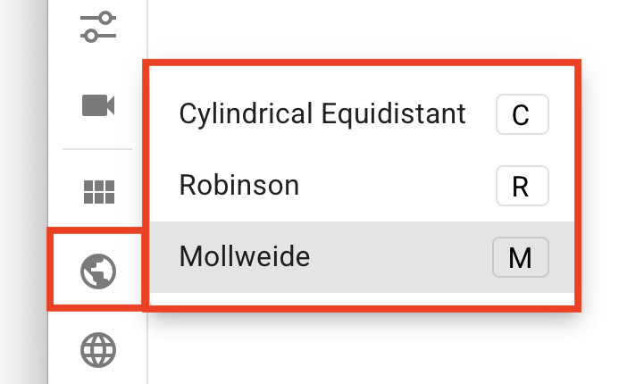
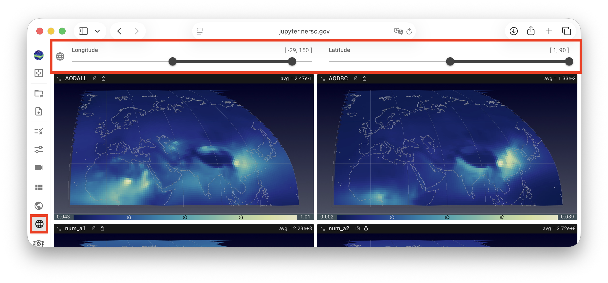
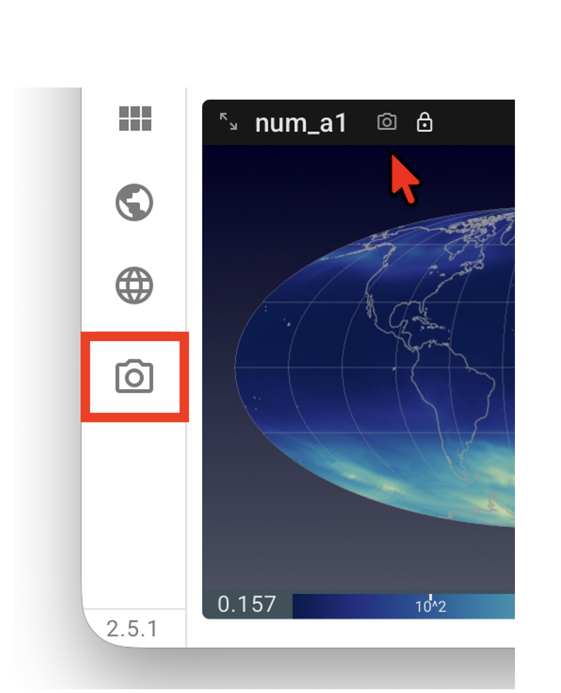
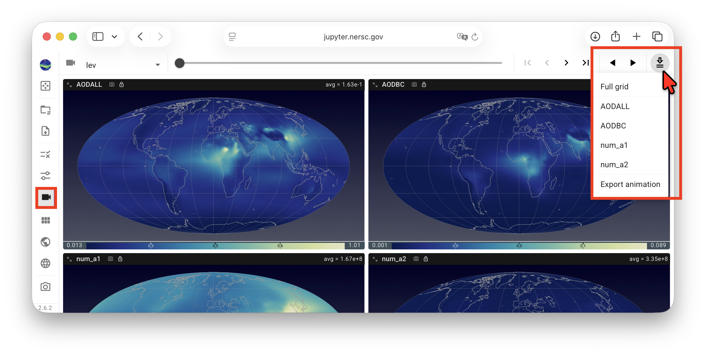
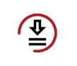

# Miscellaneous Features 

This page summarizes several addtional convenient features in QuickView.

## Choosing map projection and extent

{ width="25%", align=center }

The map projection used for the contour plots can be changed using the mini menu
activated by a click on the Earth icon in the vertical tool bar—or by keyboard shortcuts:

- `C` for cylindrical equidistant,
- `R` for Robinson, and
- `M` for Mollweide.

{ width="70%", align=right }

The map extent, i.e., the latitude-longitude bounds to be displayed in the contour plots,
can be adjusted using the sliders in the lat/lon cropping panel activated by a click on
the Earth grid icon in the vertical toolbar.

## Saving the visualization {#save-vis}

In addition to [saving the state](/guides/quickview/file_selection#state-files)
of the current session so that the analysis can be resumed later,
QuickView provides three ways for the user to save the visualization as images
or animations for presentations and manuscripts, etc.:

{ width="20%", align=right }

- A click on the **camera icon** at the end of the vertical **toolbar** saves the entire
  viewport—in its current layout—to the local computer as `FullPanel.png`.

- A click on the **camera icon** next to the variable name **inside a view panel**
  saves that single view as a `.png` file. The file name starts with the variable name;
  dimension names and indices are appended when relevant.
  For example, `aero_tau_sw-lev-71-swband-00.png` is an image of variable `aero_tau_sw`
  at `lev` index 71 and `swband` index 0.

{ width="70%", align=right }

- Let us assume the user has been inspecting 4 variables along the `lev` dimension,
  as depicted by the screenshot here. To export animations showing how these variables
  change in that dimension, the use can click on the icon on the right end of the
  animation control panel, i.e., the downward arrow with two lines,
  to bring up a drop-down menu and then click to select
  `Full grid` and/or individual variables. Subsequently, a click on `Export animation`
  triggers QuickView to scan through the indices in the `lev` dimension,
  with a dark-red circle spinning around the download button while the scanning is in progress.
  After the scan is finished, a file `quickview-animation.zip` gets downloaded to the local computer.
  This file is a zipped folder that may contain multiple files.

Note: as of version 2.6.0, the animation export functionality downloads
images of individual frames to the local computer, and the user needs to use a tool to combine
the images into an animation (or animations).
Direct download of animation files will be provided soon.

{ width="10%", align=right }

If the user clicks the animation download button again while the dark-red circle is still
spinning, then the downloaded `.zip` file will contain images from index 0 to the last index
that QuickView has scanned.
