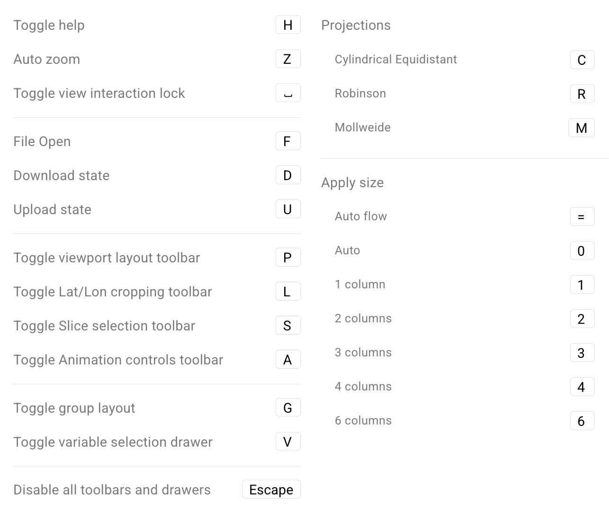

# Keyboard Shortcuts in QuickView

Below is a list of keyboard shortcuts in QuickView.
These are single-key shortcuts, and hence will not
conflict with the multi-key combinations used by
the operating system or other applications.
Note that these shortcuts will only take effect
when the browser window (or tab) showing the QuickView UI
is the active window (or tab).

{ width="90%" }
