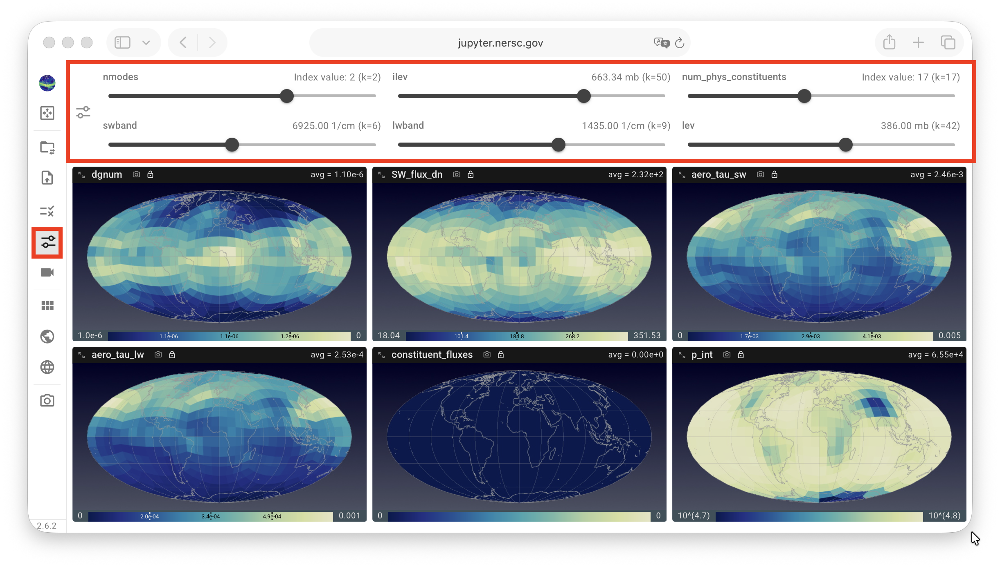
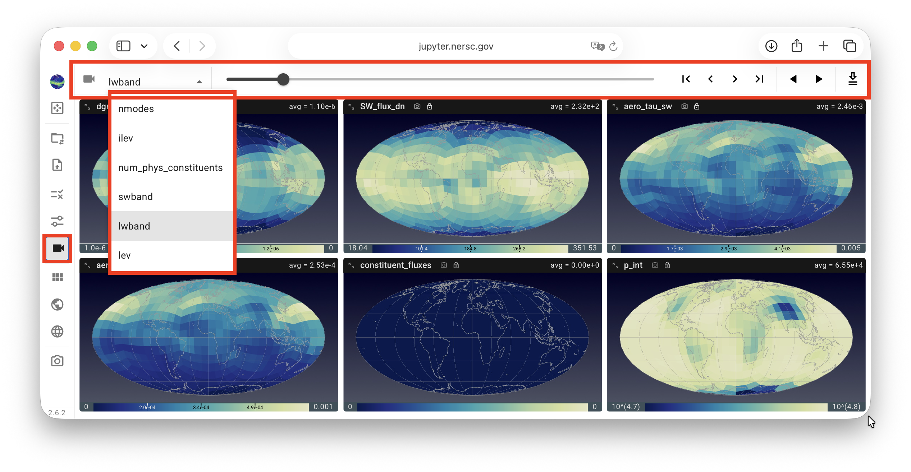

# Selecting Data Slices to Inspect

QuickView is designed to visualize variables in the simulation data file
that have horizontal dimensions representing the globe.
The variables are shown on global or regional maps.
If a variable has additional dimensions such as time, vertical level, etc.,
QuickView is designed to display one global or regional map at a time for that variable.

To choose the indices to use for the non-horizontal dimensions,
the slice selection button in the vertical toolbar can be clicked
to bring up the **slice selection control panel**, as shown in
the first screenshot below, which contains sliders for the other dimensions.

{ width="100%" }

Alternatively, the **animation control panel** shown in the screenshot below
can be used. This panel contains a drop-down menu for choosing a dimension to inspect,
a slider and a set of forward and backward buttons for manually stepping through the selected dimension, as well as a play/pause toggle button for automatically stepping through the selected dimension.

{ width="100%" }
