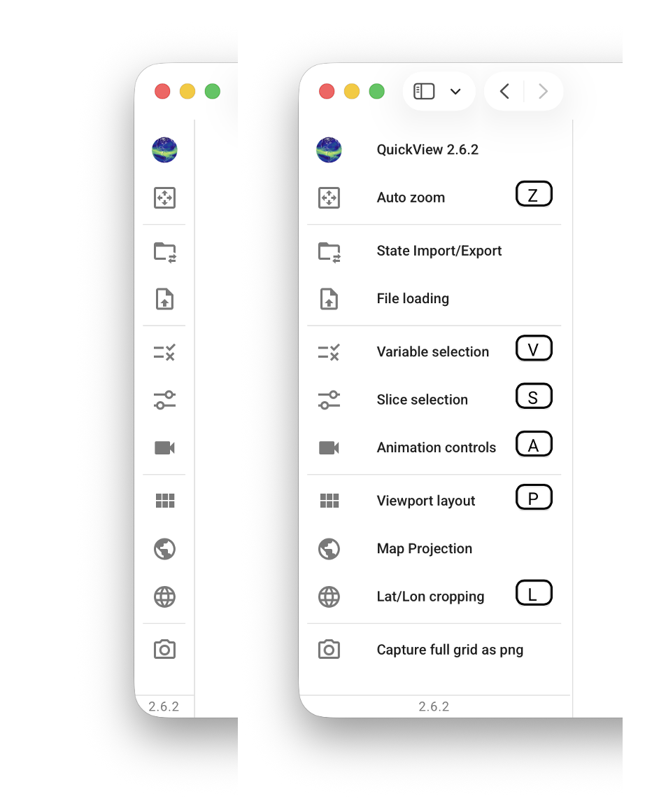

# QuickView's Graphical UI

{ width="95%" }

## UI components

QuickView's UI contains three main components.

- **Viewport**: The viewport displays global or regional map plots
  for the user-selected physical quantities (variables in the NetCDF files).
  The sequence of the displayed variables and the size of the map plots
  can be adjusted using the [viewport layout](./viewport_layout.md) control panel.
  For each variable shown on a map, the colormap, value ranges etc. can be adjusted
  individually using the [pop-up menu](./individual_views.md)
  activated by a click on the colorbar.

{ width="40%" align=right}

- **Control panels**: Various control panels allow the user to
  change properties of all map plots shown in the viewport.
  The control panels can be collapsed (hidden)
  or expanded (shown) by clicking on their corresponding icons in the
  toolbar or by using [keyboard shortcuts](./shortcuts).

- **Main toolbar**: The vertical toolbar located on the left of the UI
  contains various buttons that either activate pop-up menus on a single click
  or serve as toggles for showing or hiding control panels.
  The toolbar is shown in a collapsed mode by default, but
  will change into an expanded mode if the user clicks on the
  colorful QuickView icon at the top of the toolbar or press the
  `H` key on the keyboard. 

<!-- ## Tooltips and visual cues -->
