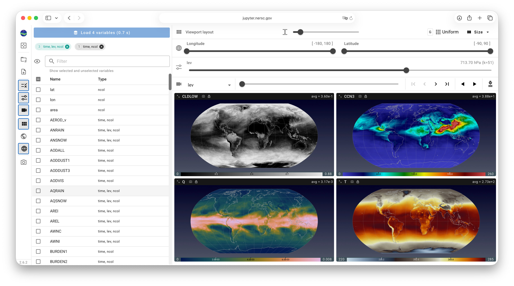
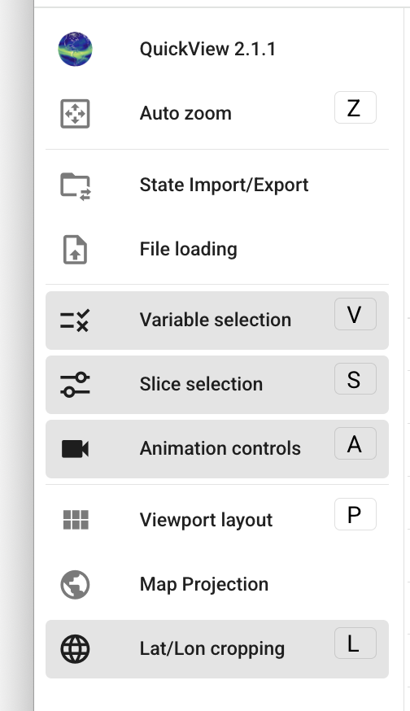

# QuickView's Graphical UI

{ width="95%" }

QuickView's UI contains three main components.

- *The **viewport** displaying global or regional maps for the user-selected
  physical quantities (variables in the NetCDF files):*
  The sequence of the displayed variables and the size of the maps
  can be adjusted using the [Viewport Layout](./viewport_layout.md) control panel.
  For each variable, the colormap, value ranges etc. can be adjusted
  separately using the [pop-up menu](./individual_views.md)
  activated by a click on the colorbar.

- *Various **control panels (drawers)** for changing properties of all maps
  shown in the viewport:*
  The control panels can be collapsed (hidden)
  or expanded (shown) by clicking on their corresponding icons in the
  toolbar or by using [keybord shortcuts](./shortcuts).

- *The vertical **toolbar** located on the left of the UI:*
  The various buttons either activate pop-up menus on a single click
  or serve as toggles for showing or hiding control panels.
  The toolbar is shown in a collapsed mode by default, but
  will change into an expanded mode if the user clicks on the
  colorful QuickView icon at the top of the toolbar or press the
  `H` key on the keyboard. 

<!-- { width="20%" } -->
