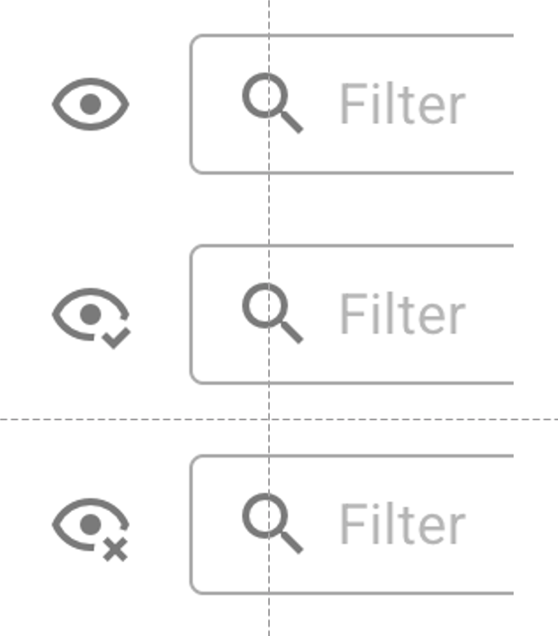
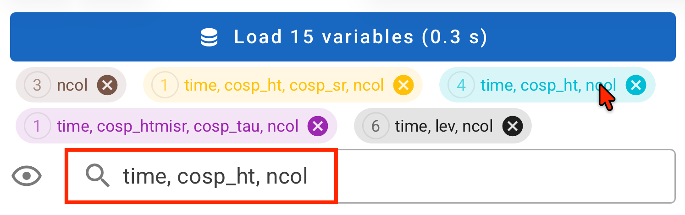

# Selecting Variables to Inspect

Starting in version 2, QuickView's variable search and selection capabilities
are substantially enhanced.
This was partly motivated by the generalization of
the tool to handle arbitrarily-shaped arrays,
and partly due to the intention to help users navigate through simulation
files containing many (e.g., hundreds of) variables.

{ width="55%", align=right }
Here, we use a simulation file with more than one thousand variables as an example
to explain the search and selection capabilities.

## Checkboxes

The first screenshot here shows how the Variable Selection panel
looks like after a simulation file has been loaded.
- The checkboxes to the left of the variable names can be used
  to select or unselect the corresponding variables.
- The first checkbox, to the left of "Name" and below the eye icon,
  can be used to select or unselect all variables on the list.

## Variable groups

{ width="55%", align=right }
QuickView sorts variables into different groups according to their dimensions
and, subsequently, allows the users to select, unselect, and inspect groups.

In the same example as discussed above, when *all* variables are selected
using the first checkbox in the Variable Selection control panel,
we get the second screenshot shown here.
- The **wide blue button** at the top of the contol panel indicates there is
  a total of 1385 variables displayable in the file.
- The **colorful tabs** correspond to different variable groups with distinct shapes.
  Each group's shape (dimension combination), as well as the number
  of displayable variables in the group, is shown inside the corresponding tab.
  Each tab also has a "close" button that can be used to unselect the entire group.

Note that at this point, QuickView has *not* loaded all the variables into memory.
It has finished a scan and *is ready to load* these variables.

## Variable search 

Below the variable group tabs and above the list of variables,
there is a text input box with a magnifying glass icon.
This box, also referred to as the filter box,
can be used to search for variables by their names or dimensions.

- **Fuzzy search**:
  As soon as the user enters text into the filter box, QuickView displays
  a filtered list of variables whose **names or dimension names** contain
  the entered string.
  Fuzzy search is case-**in**sensitive.

- **Pattern search**:
  Patterns such as `text*` or `*text` can be used to match **variable names**
  that start or end with `text`, respectively.
  Pattern search is also case-**in**sensitive.

- **Strict search**
  A string enclosed in double quotation marks (e.g., `"text"`) can be used
  to request exact matches of **variable names**,
  with no preceding or succeeding characters.
  Exact search is **case-sensitive**.

## Variable list display modes

The eye icon to the left of the text input box (filter box)
is a button for cycling through three display modes.
The icon changes to reflect the current mode:

{ width="30%", align=right }

- Eye icon – shows the **full list** of variables in the file.
- With check mark – shows only the variables currently **selected** via the checkboxes.
- With a cross – shows the variables that are **not currently selected**.

When a search or filter is active, these modes apply to the filtered list rather than
the full set of variables in the simulation file.

Also note that:

{ width="55%", align=right }

- If the user wants to return to the full list, the filter can be cleared
  by first hovering the cursor over the filter box and then clicking the cross button
  at the right end.

{ width="55%", align=right }

- Clicking a colored group tab sets the filter to that group.
  The three display modes then apply to the selection state within that group.
  A second click clears the filter.

::: info Reminder: Do not forget the `Load ... variables` button
After making your selection or adjusting it, the `Load ... variables`
buttone at the top of the control panel needs to be clicked
in order for the selected variables to be loaded into memory and
shown in the viewport.
:::
