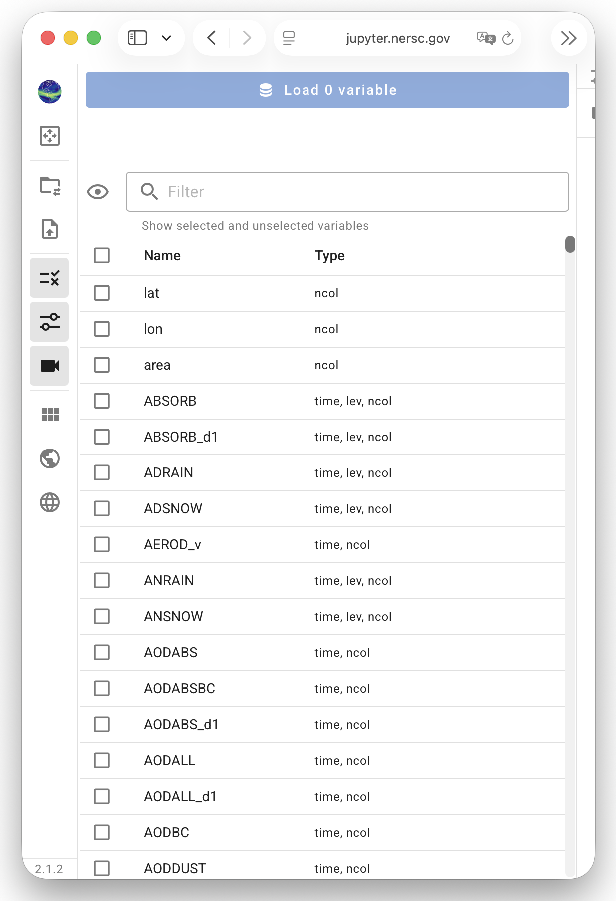
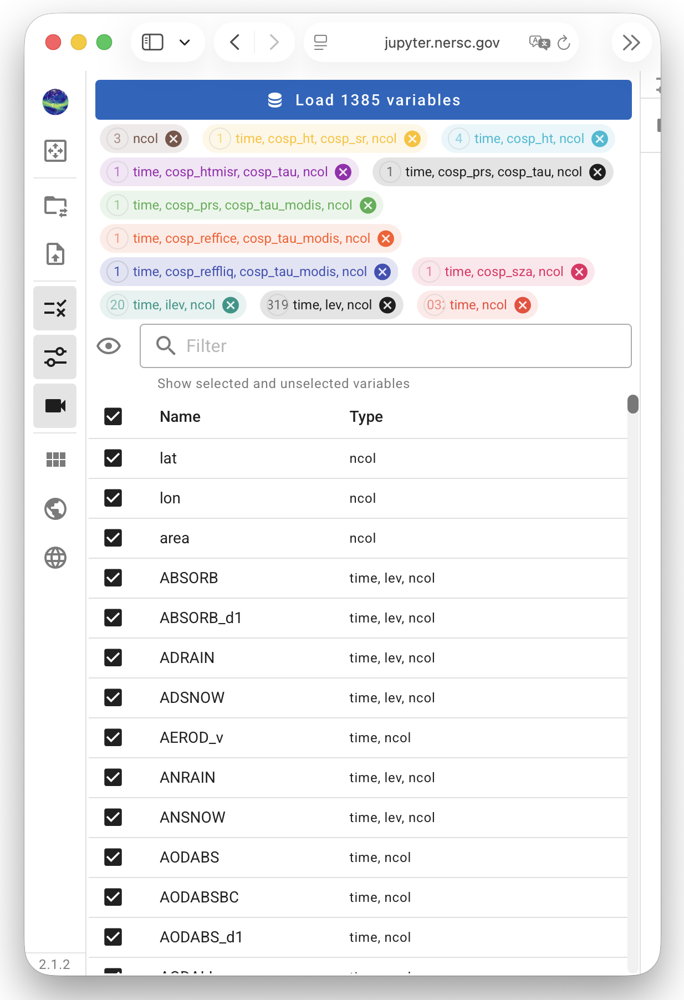

# Selecting Variables to Inspect

QuickView's capabilities of variable search and selection
has been enhanced substantially compared to the earlier version.
The enhancement was partly motivated by the generalization of
the tool to handle arbitrarily-shaped arrays,
and partly due to the intention to help users navigate through simulation
files containing many (e.g., hundreds of) variables.

Here, we use a simulation file with more than one thousand variables as an example
to explain the search and selection capabilities.

## Checkboxes for selecting and unselecting variables

{ width="55%", align=right }
The first screenshot here shows the Variable Selection panel
right after the files have been loaded.
- The checkboxes to the left of each variable name can be used
  to select or unselect the corresponding variables.
- The first checkbox, to the left of "Name" and below the eye icon,
  can be used to select or unselect all variables.

## Variable proups

{ width="55%", align=right }
QuickView sorts variables into different groups according to their dimensions
and allows the users to select, unselect, and inspect groups.

In the same example as discussed above, when all variables are selected
using the first checkbox in the Variable Selection control panel,
we get the second screenshot shown here.
- The **wide blue button** at the top of the contol panel indicates there is
  a total of 1385 variables displayable in the file.
- The **colorful tabs** correspond to different variable groups with distinct shapes.
  Each groups shape (dimension combination), as well as the number
  of displayable variables in the group, is shown in the corresponding tab.
  Each tab also has a "close" button that can be used to unselect the entire group.

Note that at this point, QuickView has *not* loaded all the variables into memory.
It has finished a scan and *is ready to load* these variables.

## The filter box

Talk points to be expanded after we further revise the filter logic:

- filter box; filter by dimension name, dimension combination, or variable name
- eye icon: cycle through lists of selected, unselected, and all variables in the filtered list.
- clicking a tab will filter the list of all variables by the shape combination.
- filter is applied immediately when contents are entered.
  - implication: when the filter box is not empty, the eye icon and the first checkbox
    will operate on the filtered list. If the user wants them to apply to the full list
    of displayable variables instead, then the filter box should be cleared by deleteing the
    text;  a shortcut would be to use the "close button" that shows up when the cursor
    hoves over the filter box".

::: warning Reminder: Use the `Load X variables` button to apply selection or change
:::
