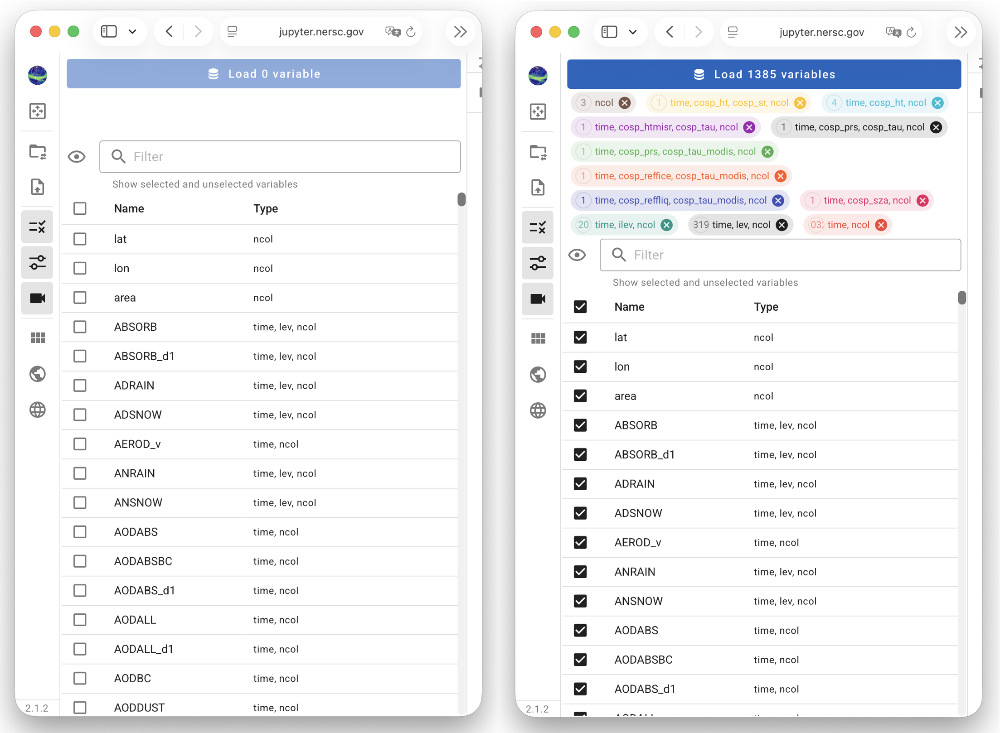

# Selecting Variables to Inspect

QuickView's capabilities of variable search and selection
has been enhanced substantially compared to the earlier version.
The enhancement was motivated partly by the generalization of
the tool to handle arbitrarily shaped arrays defined on the cubed sphere,
and partly due to the wish to help users navigate through simulation
files containing many (e.g., hundreds of) variables.
Here, we use a file with more than one thousand variables as an example
to explain the search and selection capabilities.

<!-- { width="95%", align=center } -->

{ width="55%", align=right }
The first screenshot shows the Variable Selection panel
right after the files have been loaded.
- The checkboxes to the left of each variable name can be used
  to select or unselect the corresponding variables.
- The first checkbox, to the left of "Name" and below the eye icon,
  can be used to select or unselect all variables.

{ width="55%", align=right }
When all variables are selected using the first checkbox, we get the second screenshot shown here.
- The **wide blue button** at the top of the contol panel indicates there is
  a total of 1385 variables displayable in the file.
- The **colorful tabs** correspond to different variable shapes (dimension
  combinations). The different cominations, as well as the number
  of displayable variables in each group, are shown in the tabs.

Note that at this point, QuickView has *not* loaded all the variables into memory.
It has finished a scan and *is ready to load* these variables.
The user can deselect groups of variables by clicking on the close buttons
on the right of each tab.

Additional talk points:

- filter box; filter by dimension name, dimension combination, or variable name
- eye icon: cycle through lists of selected, unselected, and all variables in the filtered list.
- clicking on a tab applys filter by shape combination.
- close button in filter box clears filter (make cross always visible) 

