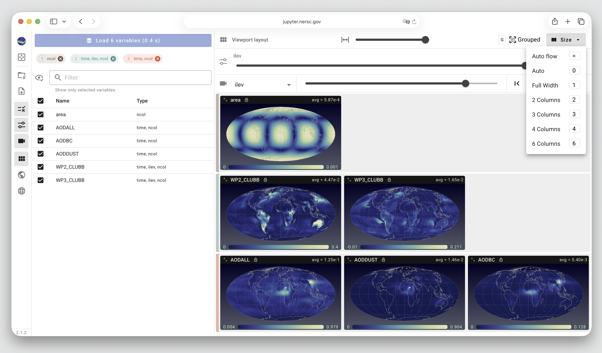
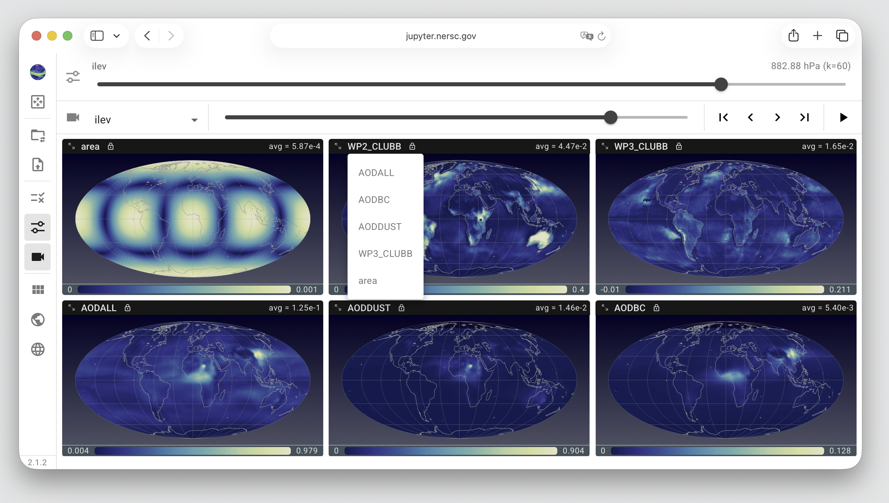

# Customizing Viewport Layout

::: For users of QuickView version 1
QuickView version 1 allowed the user to change the size and sequence
of different views (map plots) in the viewport by drag-and-drop.
Users' feedback indicated that arbitrary drag-and-drop can get confusing,
and it was inconvenient to not having a way to reapply the same size to all views.
With these comments in mind, we have changed the mechanisms for
configuring the viewport in version 2.
:::

## View size

QuickView version 2 supports showing 1, 2, 3, 4, or 6 columns of views (map plots)
in the view port. The number of columns can be changed by pressing the desired number
on the keyboard or using the Viewport Layout control panel, via the "Size" menu
on the right of that panel, as shown in the screenshot below.

The viewport is evenly divided into the selected number of columns.
When the user adjusts the size of their browser window, the
sizes of the map plots will be automatically adjusted to fit into the adjusted browser window.

{ width="95%", align=center }

## Grouped or ungrouped views

If the user has selected and loaded variables of different shapes,
then, by default, the viewport will present the map plots in groups.
For each group, a vertical bar, shown in the same color as the group tab
in the Variable Selection control panel, is shown on the left side of
the viewport to distinguish the group.
The screenshot above shows 3 variable groups. 

This grouping in the viewport can be canceled (or reapplied) by using
the `G` key or a "Grouped" versus "Ungrouped" toggle.

## Variable sequence

In the top-left corner of each individual view, the variable name is shown.
Clicking the text will activate a drop-down menu for the user to replace
the current variable by a different one.

If the plots in the viewport are ungrouped, the drop-down menu will
list all the other variables that have been loaded. See example
in the screenshot below.

If the plots in the viewport are grouped, the drop-down menu will
list all the other loaded variables *in the same group*.

{ width="95%", align=center }
