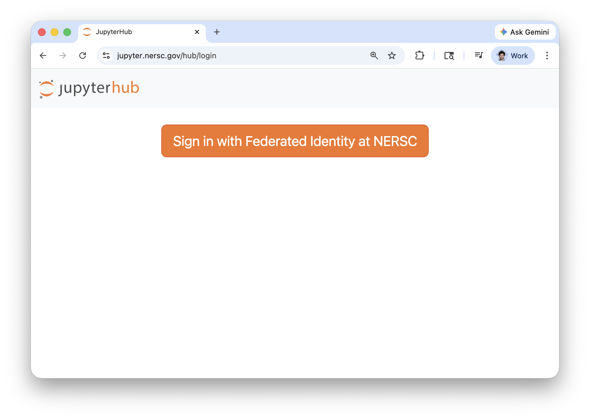
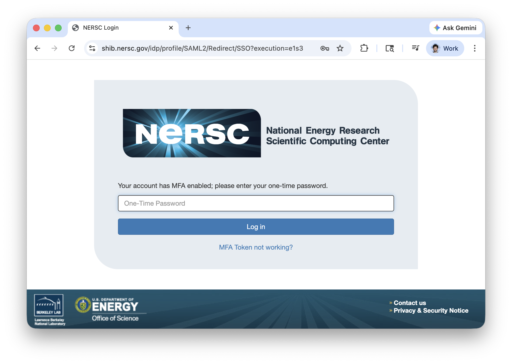
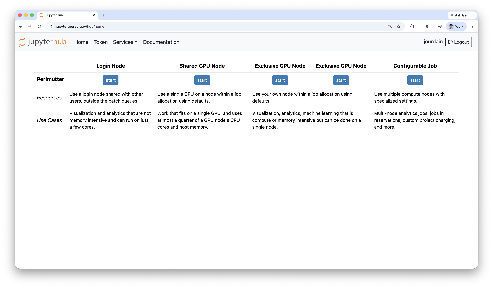
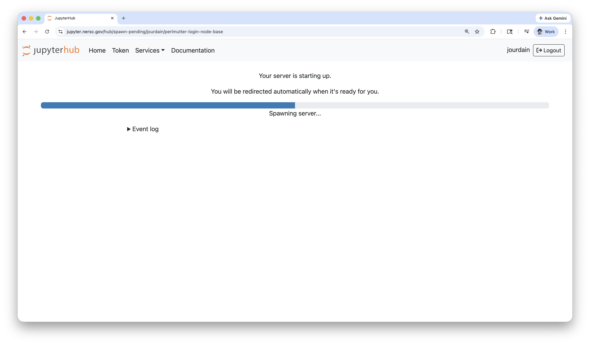
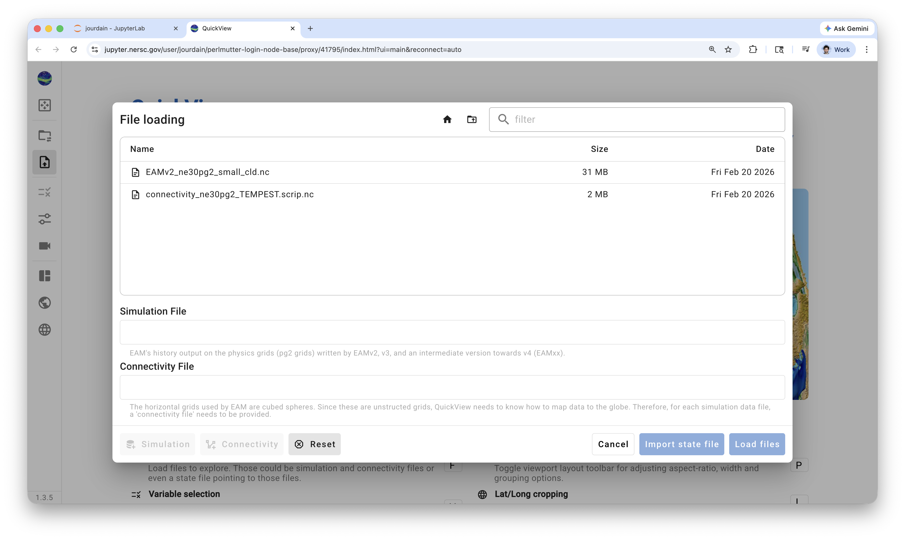

# QuickView @ NERSC

To use QuickView at NERSC, you first need to login

[ Click on the image to go to the login page](https://jupyter.nersc.gov/hub/login)

Once you've enter your __login__ and __password__ you will need to feel a OTP.



At that point you will presented with a list of options on where you would like to run your application.
For QuickView it is better to have hardware with a GPU to allow interactive rendering.



Once you picked your target location and allocation, you will have to wait for the service to start.



## QuickView

Once connected, you should start the terminal from the Launcher options of JupyterHub. Then you should go to the directory that contains the data you would like to see. While that step is optional, it may save you some navigation time with the application UI.

Once ready, you should start the application by running:

```sh
/global/common/software/m4359/quickview
```


Click on the link provided by the application execution.
Then in the new graphical interface showing in the new browser tab, select the files you aim to load.



Finally select the fields you want to load and inspect.


## Release resources

Can be access in the Menu `File > Hub Control Panel`


