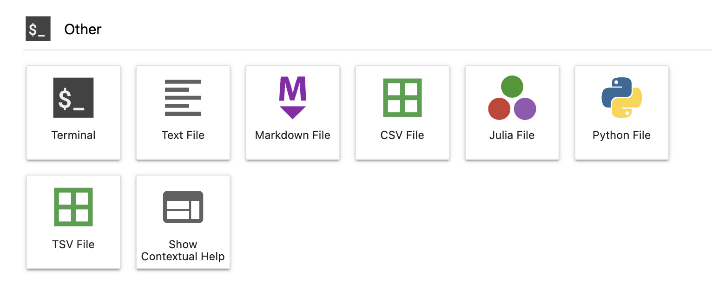
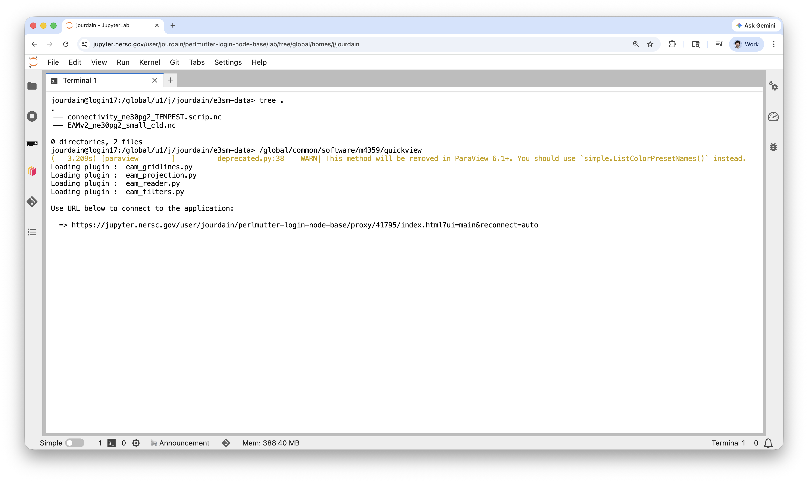
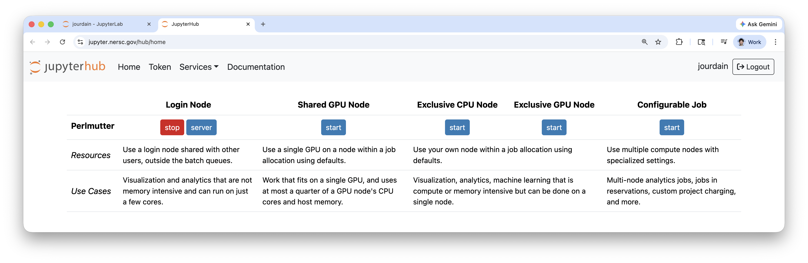

# QuickView @ NERSC

## Log in to NERSC

To use QuickView at NERSC to directly access and analyze data files there,
users need to first connect to NERSC using JupyterHub, as described
[on this page](./jupyter_at_nersc.md).

Once connected,

- Start a terminal from the Launcher options of JupyterHub.
  You will likely need to scroll down in the Launcher in order to
  see the "Other" section and the terminal icon there, as shown in the screenshot below.
  Click on the terminal icon, and the Launcher window should turn into a shell.
  

- *Optional but recommended*: in the shell, use the `cd` command to go to
  the directory where your data files are located (or a directory closer to the data files than your home directory).
  While that step is optional, it may save you quite some clicks later in the graphical UI.

- Starting **QuickView** using the command `/global/cfs/projectdirs/m4359/tools/quickview2` in the shell.

- After some seconds, the terminal window will provide a URL, similar to the screenshot below.
  A click on the URL will bring up the graphical UI in a separate brower window or tab.
  

- The graphical UI will prompt you to choose connectivity and simulation files, see example below.
  Double click your connecitivity file and then the simulation file, then
  click on the blue "Load Files" button in the bottom-right corner
  

- Finally, select the variables you want to load and inspect.
  

## Shutting down the server

::: warning ATTENTION: Shut down the server when you are done!
After finishing your analysis, please remember to shut down the connection to your
assigned node to avoid keeping the resource idle and unnecessarily charging
to your project's allocation. This is explained at the end of
[this video](https://docs.nersc.gov/beginner-guide/#keypad-entry-log-in-using-jupyter).
Also see below for a recap of the steps (clicks).
:::

- Go to the JupytherHub window/tab in your browser.
- Click on `File` in the top-left corner.
- Scroll down and choose `Hub Control Panel`.
- In the Control Panel brought up in a new browser tab or window,
  click on the red "stop" button for the server to be shut down.
  An example is shown in the screenshot below.

